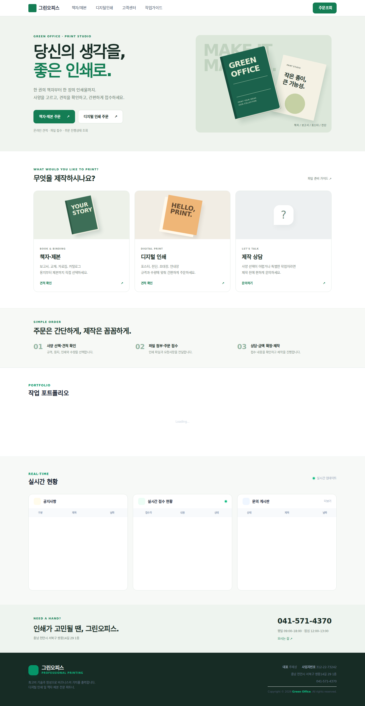
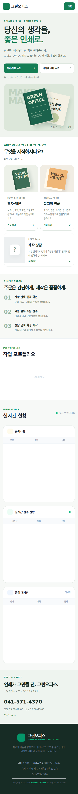
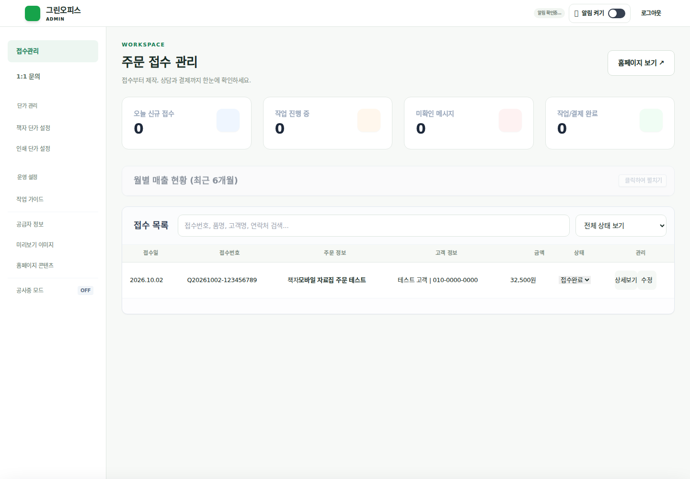
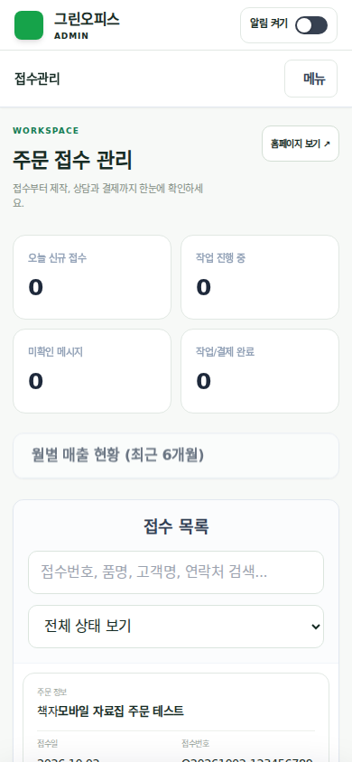

# 그린오피스 반응형 리뉴얼

## 원본 백업

- 기준 커밋: `b7acb2b8151b3dfd5e730f99cbc8e31b2940d05a`
- 백업 브랜치: `backup/main-2026-10-02-before-responsive-renewal`
- 작업 브랜치: `design/responsive-renewal-2026-10-02`
- 별도로 원본 ZIP 및 전체 Git 기록의 bundle을 생성하고 bundle 무결성을 검증했습니다.

## 변경 화면

- 메인: 책자·디지털인쇄 진입 버튼, 상품 카드, 주문 과정, 포트폴리오, 접수 현황, 고객센터.
- 주문: 단계 탐색, 번호가 있는 사양 카드, 하단 예상금액·접수 버튼, 견적 상세 바텀시트.
- 관리자: PC 사이드바, 모바일 주문·문의 카드, 기존 상세·수정·상태 변경 버튼 유지, 알림을 헤더로 이동.
- 주문조회·마이페이지·고객센터·설정 페이지: 공통 색상, 입력창, 터치 크기와 여백 적용.
- 디자인 CSS를 정적 로딩하여 Firebase 초기화 여부와 관계없이 표시합니다.
- 가격 계산, 접수 및 수정 처리, 인증, Firestore/Storage 규칙과 Functions를 유지합니다. 책자 계산 결과를 표시용 dataset으로 전달하는 한 줄만 추가했습니다.

## 검증

- `npm run test:ci`: 통과 (계산기, 입력/저장, 페이지 모듈, 보안 계약, 헤더).
- `npm run build:css`: 통과.
- `npx playwright test tests/e2e/responsive-renewal.spec.mjs`: PC·모바일 프로젝트 총 14건 통과.
- 360 / 390 / 768 / 1024 / 1440px에서 메인, 책자 주문, 인쇄 주문, 마이페이지, 관리자 가로 넘침 검사.
- 기존 금액과 하단 표시 일치, 견적 상세 열기·Escape 닫기, 원본 접수 핸들러 호출, 처리 중 버튼 비활성화, 단계 이동, 관리자 상태 입력, PC 사이드바 위치와 클릭 가능 여부 검사.
- 전체 브라우저 검사: 40건 통과, 6건 실패. 실패는 디지털인쇄 용지 옵션 초기화 및 Firebase 안내문 로딩 3종 × PC·모바일입니다. 원본 커밋에서 동일 3종을 PC로 별도 실행해 같은 실패를 재현했습니다. 이 환경의 외부 Firebase 모듈/연결 제한 때문에 실제 인증 및 주문 저장·파일 업로드까지 검증하지 못했습니다.
- 미리보기 이미지 및 새 UI 검사는 운영 고객 데이터 대신 테스트 fixture를 사용했습니다. 화면에 표시된 주문·금액은 테스트용입니다.

운영 적용 전 PR의 Firebase 미리보기에서 실제 로그인, 견적 단가 로딩, 첨부파일 업로드, 주문 생성·수정, 상담 및 관리자 상태 저장을 확인하세요.

## 미리보기

